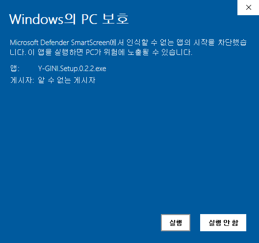

Y-GINI는 논문을 한글로 번역(구글) 해주는 쉬운 도구입니다. 📖

## 왜 만들었나요?

해외 논문들을 구글 번역기를 돌릴 때 여러 가지 불편함이 있습니다. 단순히 논문의 내용을 복사해서 붙여 넣을 경우 문장의 중간에서 줄바꿈이 일어나서 이를 아래처럼 일일이 제거해 주어야 올바른 번역 결과를 얻을 수 있습니다. 두 번째로 각 문장의 각주로 인해 질 좋은 번역 결과를 얻지 못합니다. 또한 번역 결과의 가독성을 높이고 싶었습니다.

## 주요 기능

- 구글 번역 (Englisgh to Korean)

  모든 번역은 [구글 번역기](https://translate.google.com/)를 기반으로 하고 있습니다. 따라서 한 번에 최대 가능한 글자 수도 5000자로 제한되어 있습니다.

- 줄바꿈 제거

  논문의 본문을 붙여 넣을 때, 문장 사이에서 줄바꿈이 일어나는 경우 이를 '띄어쓰기'로 대체합니다.

- 각주 제거

  일부 각주를 제거합니다. 원문을 망가뜨리는 일을 방지하기 위해 모든 각주를 제거하지는 않습니다.

- 모든 문장 분리 (SPLIT-ALL)

  가독성을 높이기 위해 문장단위로 분리하여 볼 수 있는 기능을 제공합니다.

## 다운로드 및 설치

- 다운로드

  y-gini는 Windows 플랫폼만을 지원합니다. 추후 요청이 있으면 OSX 플랫폼을 지원할 계획입니다. 아래 링크를 누른 뒤 [Y-GINI.Setup.0.2.2.exe](https://github.com/sjquant/y-gini/releases/download/0.2.2/Y-GINI.Setup.0.2.2.exe)를 다운로드합니다.

  [[📌클릭해서 다운로드 하기📌]](https://github.com/sjquant/y-gini/releases)

- 설치

  이 프로그램은 CodeSigning이 되어있지 않습니다. (돈이 없습니다..) 그래서 설치 파일을 실행하면 아래와 같은 경고가 나옵니다.

  

  추가 정보를 누른 뒤 실행을 눌러주면 설치가 완료됩니다.

  

- 사용법

  워낙 단순한 프로그램이라 조금 만져보시면 다들 아실 거라고 믿습니다. 😀

## Dependencies

- [`Electron`](https://github.com/electron/electron)
- [`Quasar`](https://github.com/quasarframework/quasar)
- [`Puppeteer`](https://github.com/puppeteer/puppeteer)
